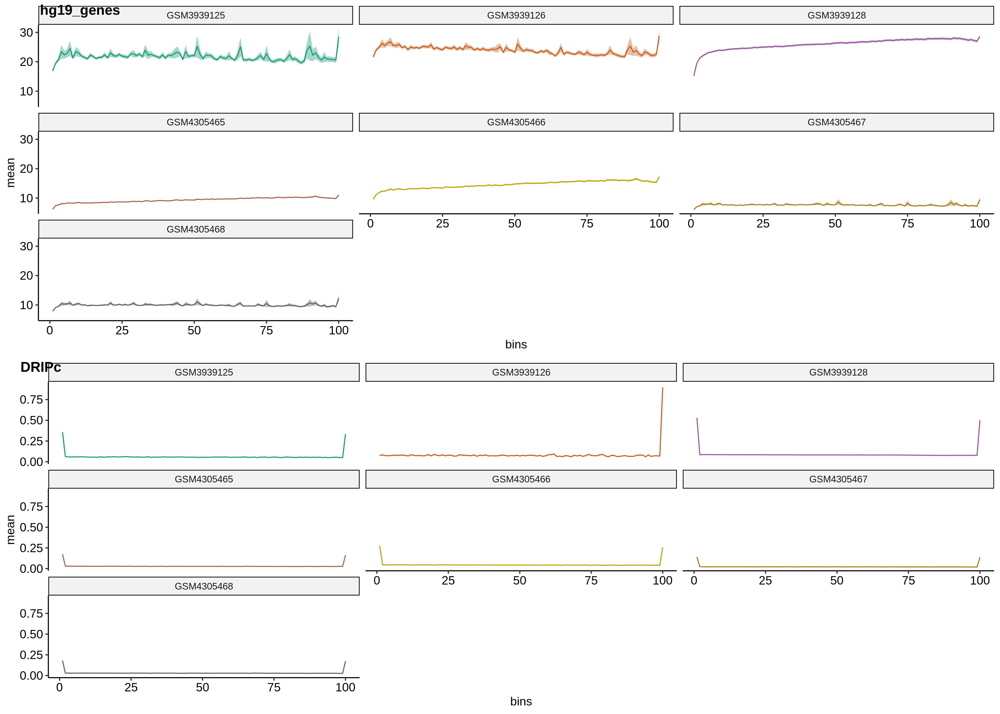
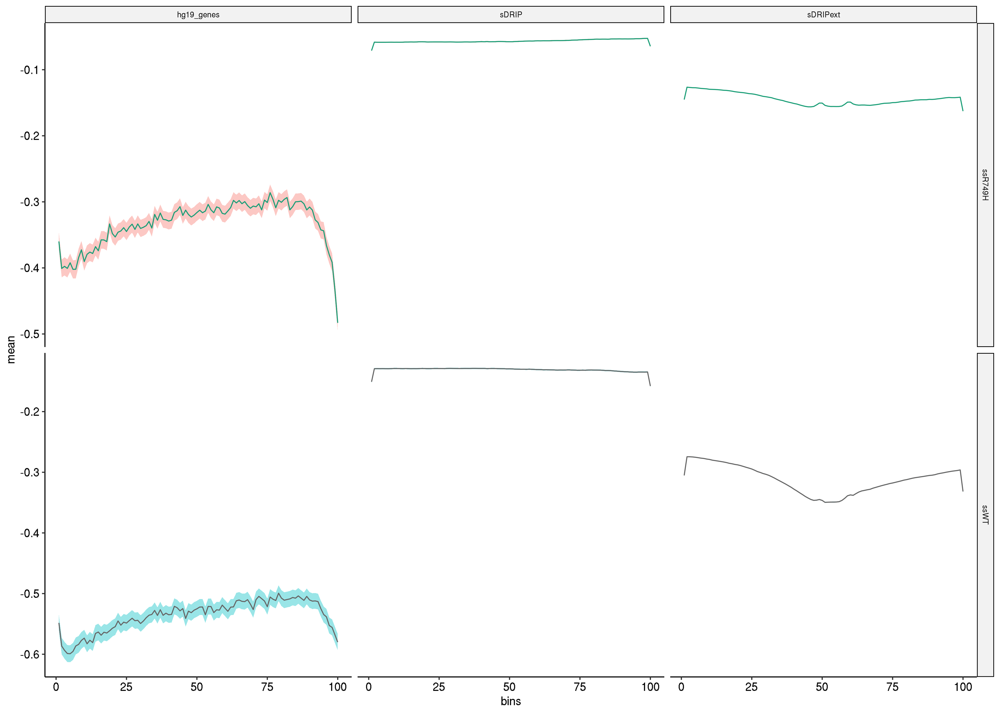
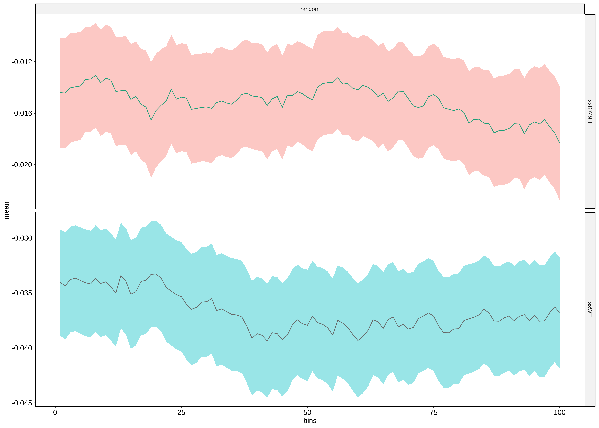
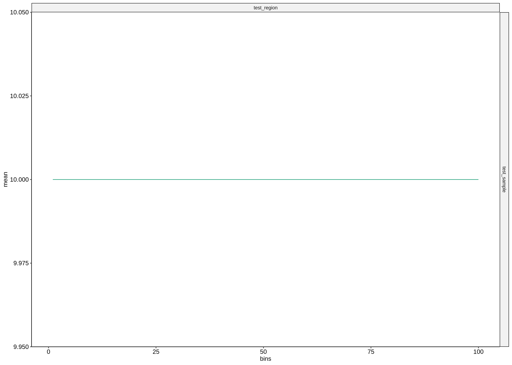

# Issues with DRIP based metaplots

## The problem

When using DRIPc data as the regions of interest, seeing weird spikes
at the heads and tails of curves. I saw this before major updates
made this week 

and a still seeing it afterwards.

What is really strange to me is that these are seen both
when plotting the DRIP data "as is" and when each end
is extended by 1000 kp.

I am thinking maybe there is overlap between regions and
that could be causing issues possibly. It would seem that
overlaps might tend to be at the end of regions and so
these locations would be counted twice. 

When using randomly generated regions in hg19 these sudden dips are not seen.

Also tested using very simplified input files, one region covered by one score (10) which worked correctly.

## Testing merging DRIP bedgraphs

Added additional rules when creating DRIP input files that calls
bedtools merge on both the bw -> bedgraph output and the extended
`bedtools slop` output to test if overlapping regions were
causing issues at the ends. 