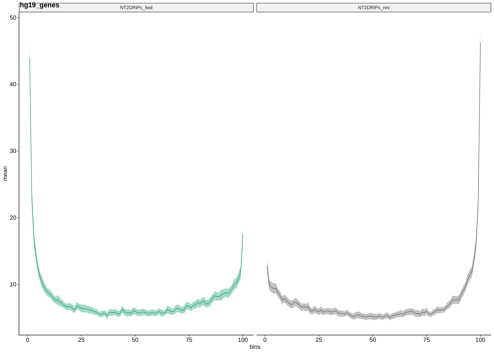
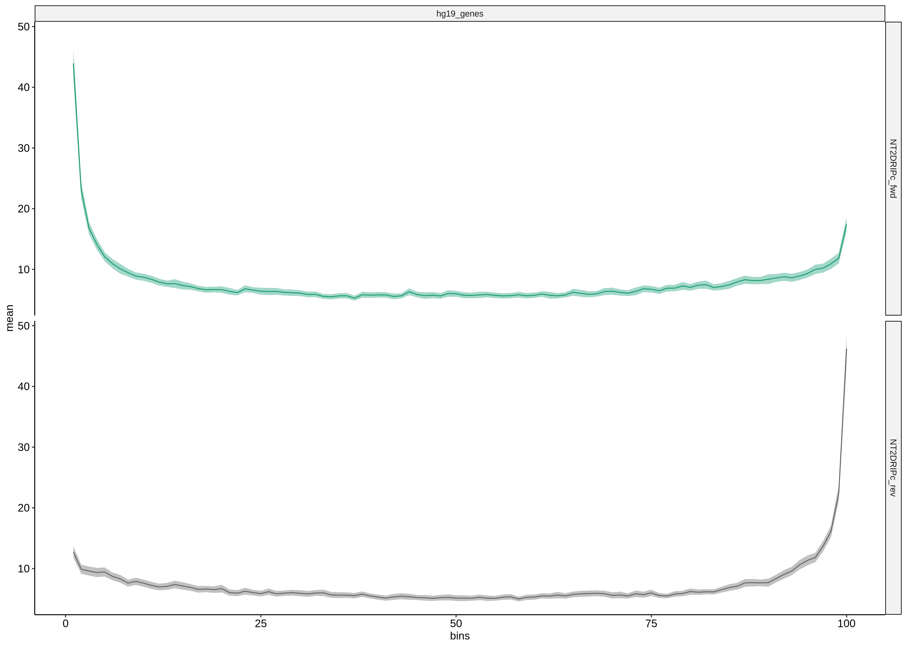

# Testing updates

Got things pretty much working last night. Tested with 
`test/rand_feats_samples.py` script which configured so would generate
random regions and observations only at the first base of each feature taking
strand into account. Expected this to produce metaplots with a large peak
right at the first bin and no where else and that is what program produced.

Also so expected results for Fisher plots. Since all regions in
the observation file where located in the regions file. Differences
in + / - strand are due to low sample size and randomly selecting
which strand a regions will be on.

Continued working on bedgraph type inputs for samples using the DRIPc
wig -> bedgraph as inputs. Seems to be pretty much working as well.

There are two samples, one for each strand and when bedgraph data is input
it does not consider strandedness which is why the fwd and rev graphs are
reflected. For now if you want strandedness to be considered input should
be in bed6 format.

But overall the shape of the plots look correct, high signal at the start
of genes, lower in the gene body and then slight increase at 3' ends. Then
changed plotting script to use `facet_grid` for regions instead of 
making distinct plots and stitching together with `ggarrange`. 

There are also some issues with the Fisher plots when bedgraph samples
are input since the R script is currently expecting strandedness.

## Created `runs` dir

This directory should be used to store config, sample and region specifying
files in a sub directory with a meaningful name. That way when want to rerun
can just point snakemake to the files in those directories.

Each subdir should also have a `run.sh` script to run the pipeline for the
specific metaplot and should be able to be invoked from the `metaploter`
directory (use relative paths in config type files with this in mind). 

## Bedtools `map` notes

Watch out when using `map` command if there are no overlaps default value of
`.` is printed when often times (and in this case) we want this value to be 0. 

